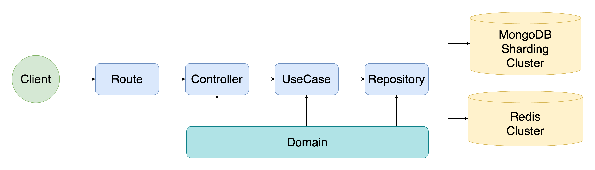
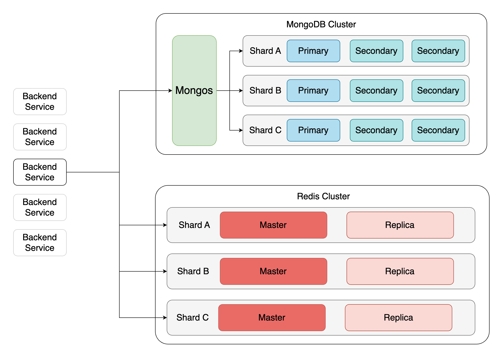

# Ad-placement-service
廣告投放服務後端
## ✨ Feature
* 使用 Clean Architecture 
* 使用依賴注入 (go-fx)
* 使用 environment files 控制環境變數
* 使用 Redis Cluster 建立分散式快取
* 使用 MongoDB Sharding 分散資料與建置 Replica set
* 使用 Singleflight 避免 Cache Hotspot Invalid
* 使用 docker compose 建立開發環境
* 使用 kubernetes 部署至正式環境
* 無狀態服務設計
## 🏗️ Architecture
### 模組架構

* Route - 接收 Client 的請求並發至對的 Controller
* Domain - 定義實體的資料結構與相關的的介面
* Controller - 處理請求資料與驗證參數並呼叫對應的 UseCase
* UseCase - 商業邏輯實作，呼叫 Repository 讀寫資料
* Repository - 與 Database 和 Cache 連接寫入或是讀取資料
### 部署架溝

* MongoDB Cluster    
  ✦ feature:
    * 具有水平擴展的能力
    * 提升查詢效率
    * 提供備援機制
  
  MongoDB Cluster 具有分散式與備援的機制，通過建立 Shard key 將資料依照 key 分配到對應的 Chunk，在此專案中採用了 compound index 作為 Shard key，
  依照`title` hash value 以及 `_id` 區間分成數個 Chunk，這可使查詢的速度提升。
  ```shell
    sh.shardCollection("db.advertisements",{'_id': 1, 'title':'hashed'})
  ```
  每個 Shard 具有兩個 Secondary 的 Replica Set 可以備份與當作唯讀操作的節點。外部訪問通過 `Mongos` 路由到各個 Chunk ，
因此對於外部 Client 來說不需要與每個 Chunk 的 `Mongod` 建立連接，可以減少遷移的成本。
    
     
* Redis Cluster  
  ✦ feature:
    * 高可用性
    * 無中心化管理
    * 節點自動尋找
    * 分散式儲存
  
  Redis 作為資料庫快取可以提升查詢效率，考慮到讀取的次數遠大於寫入的次數以及廣告不會立即生效的特性，在快取策略上使用 Cache aside，
  實作上將查詢參數作為 key 並附加有效期限，減少資料不一致的問題。   
  Redis Cluster 沒有像 MongoDB Cluster 一樣有路由層(`Mongos`)，但具有感應能力，
  一旦連上一個節點就或告知其他節點位置讓 Client 個別建立連線，如果 Master 突然掛掉 Replica 作為備援可以立即成為 Master 讓快取不中斷。
## 🚀 Quick Start
啟動服務
```shell
mv .env.example .env
docker compose up -d --build 
```
建立廣告
```shell
curl --location '127.0.0.1:3000/api/v1/ad' \
--header 'Content-Type: application/json' \
--data '{
  "title": "Travel Package Deals",
  "startAt": "2024-01-10T08:00:00.000Z",
  "endAt": "2024-06-10T20:00:00.000Z",
  "conditions": {
      "ageEnd": 30,
      "country": ["TW", "JP"],
      "platform": ["android", "ios","web"],
      "gender": "M"
  }
}'
```
查詢廣告
```shell
curl --location '127.0.0.1:3000/api/v1/ad?limit=1&age=28&gender=M&country=TW&platform=web&offset=0' 
```
關閉
```shell
docker compose down
```